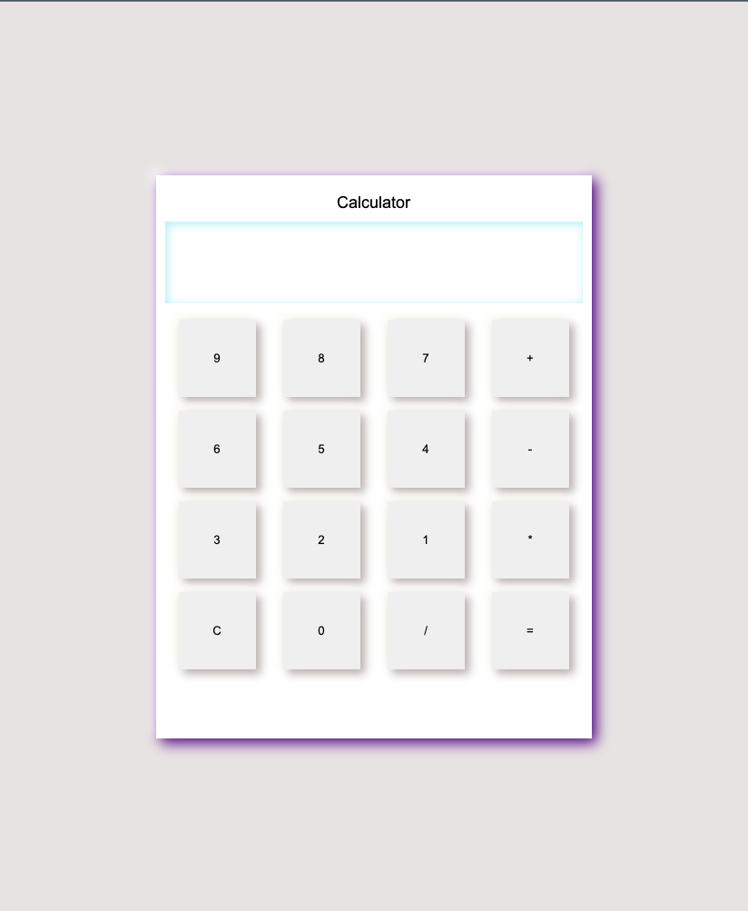

# Calculator Web App

This is a simple web application built using HTML and CSS, providing basic calculator functionalities. Users can perform addition, subtraction, multiplication, and division operations on the calculator.

## How to Use

1. Clone the repository or download the HTML and CSS files.
2. Open the `index.html` file in your web browser.
3. The calculator interface will be displayed, allowing you to perform calculations.

## Features

- Responsive Design: The calculator web app is designed to adapt to various screen sizes, making it accessible on different devices.
- Easy-to-Use: The user-friendly interface allows for effortless calculation.
- Basic Arithmetic Operations: Addition, subtraction, multiplication, and division functionalities are provided.

## Screenshots

## Contributing

Contributions are welcome! If you find any bugs or have suggestions for improvement, feel free to open an issue or submit a pull request.

## License

This project is licensed under the [MIT License](LICENSE). Feel free to use and modify this code as per the license terms.

## Author

- Name: [Karan Bagle]
- Email: [karanbagle01@gmail.com]
- GitHub: [GitHub Profile]([https://github.com/yourusername](https://github.com/karanbagle))

Feel free to reach out to me if you have any questions or feedback.

Happy calculating! 😊
